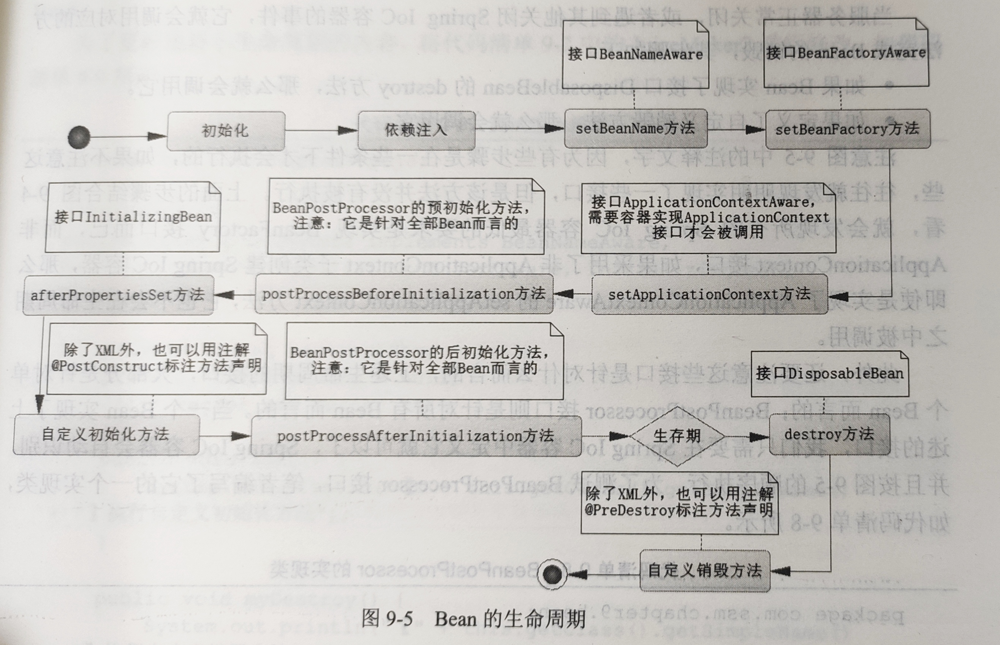

## 第九章 Spring IOC的概念

- **Spring**的成功来源于理念，而不是技术，它最为核心的理念是**IOC**(控制反转)和**AOP**(面向切面编程)，其中**IOC**是**Spring**的基础，而**AOP**则是其重要的功能。最为经典的当属数据库事务的使用。

### Spring概述

- **Spring**的出现是因为当时**SUN**公司的**EJB**的失败，尤其是**EJB2**的时代，**EJB2**需要许多配置文件，需要配合很多抽象概念才能运用，虽然**EJB3**克服了配置方面的冗余，但是对于**Java EE**开发而言，更为致命的是对**EJB**容器的依赖，也就是**EJB**只能运行于**EJB**容器中，**EJB**容器的笨重，给企业应用带来了困难。而在**EJB**开发中，需要选择**EJB**容器(如：**WildFly**,**WebSphere**,**Glassfish**,**WebLogic**等)，然后通过这些**EJB**容器发布**Bean**，应用则可以通过**EJB**容器获得对应的**Bean**。

#### EJB存在的问题

  - 首先，他比较缓慢，从容器中得到**Bean**需要大量的远程调用，反射，代理，序列化和反序列化等步骤。
  - 对**EJB**容器依赖比较严重，难以达到快速开发和测试的目的。
  - 由于使用**EJB**需要从**EJB**容器中获得对象，所以测试人员只能不断地部署和配置。对于测试而言，有时候一个对象比较复杂，它往往需要由其他对象作为属性组成。
  - 在当时的**Java**技术中，很多框架都是侵入性的，也就是必须使用当前框架所提供的类库，才能实现功能，这样会造成应用对框架的依赖。

- 在**Spring**中，它会认为一切**Java**类都是资源，而资源都是**Bean**，容纳这些**Bean**的是**Spring**所提供的**IOC**容器，所以**Spring**是一种基于**Bean**的编程。

- 基于接口编程是一种理念，强调**OOD**的设计理念，比技术实现更为重要。

- **Spring**技术不是为了取代现有的技术(当时的**Struts1**,**Hibernate**,**EJB**,**JDO**等)，而是提供更好的整合模板使它们能够整合到**Spring**技术上来。

#### Spring的优势

- 它不依赖于**Spring**所提供的**API**，也就是无侵入性或者低侵入性，即使**Java**应用离开了**Spring**依旧可以运行，这使得**Spring**更加灵活，拥有即插即拔的功能。
- 其次，**Spring**不是去取代当时存在的**EJB**，**Hibernate**，**JDO**等技术，而是将这些框架和技术整合到**Spring**中去。

##### 基于上述理念，Spring提供了以下策略

- 对于**POJO**的潜力开发，通过提供轻量级和低侵入的编程，可以通过配置(**XML**,**注解**等)来扩展**POJO**的功能，通过**依赖注入**的理念去扩展功能，建议通过接口编程，强调**OOD**的开发模式理念，降低系统耦合度，提高系统可读性和可扩展性。
- 提供切面编程，尤其是把企业的核心应用---数据库应用，通过切面消除了以前复杂的**try...catch...finally**代码结构。
- 为了整合各个框架和技术的应用，**Spring**提供了模板类，通过模板类可以整合各个框架和技术，如支持**Hibernate**开发的**HibernateTemplate**。

### Spring IOC概述

#### 被动创建对象

- 下面提供果汁制造器(**JuiceMaker**),那么只需要对其进行描述就可以得到果汁。假设饮品店还会给我们提供这样的一个描述(**source**)。

- ```java
  public class JuiceMaker{
  	private String beverageShop = null;
  	private Source source = null;
  
  	//setting & getting
  
  	public String makeJuice() {
  		String juice = "这是一杯由" + beverageShop + "饮品店，提供的" + source.getSize() + source.getSugar() + source.getFruit();
  		return juice;
  	}
  }
  ```

- ```java
  public class Source {
  	private String fruit;// 类型
  	private String sugar;// 糖分描述
  	private String size;// 大小杯
  }
  ```

- 系统采用**XML**对清单进行描述

- ```xml
  <bean id="source" class="com.ssm.chapter9.pojo.Source">
  		<property name="fruit" value="橙汁" />
  		<property name="sugar" value="少糖" />
  		<property name="size" value="大杯" />
  	</bean>
  ```

- 接着对饮品店进行描述。

- ```xml
  <bean id="juiceMaker" class="com.ssm.chapter9.pojo.JuiceMaker">
  		<property name="beverageShop" value="贡茶" />
  		<property name="source" ref="source" />
  	</bean>
  ```

- 上面将饮品店设置为贡茶，这样就指定了贡茶为我们提供服务，而订单则引用我们之前的定义。

- ```java
  public static void testIoC() {
  		ClassPathXmlApplicationContext ctx =
  				new ClassPathXmlApplicationContext("spring-cfg.xml");
  		JuiceMaker juiceMaker = (JuiceMaker) ctx.getBean("juiceMaker");
  		System.out.println(juiceMaker.makeJuice());
  		ctx.close();
  	}
  ```

- 上面过程中，果汁是由贡茶所制作的，我们并不关心制造的过程，我们所需要关心的是对果汁如何描述，选择哪个店去制作，这才是现今人们的习惯。

#### Spring IOC阐述

- 控制反转是一种通过描述(在**Java**中可以是**XML**或**注解**)并通过第三方去产生或获取特定对象的方式。
- 在**Spring**中实现控制反转的是**IOC**容器，其实现方法是**依赖注入**(**Dependency Injection,DI**)。
- 在一个系统中有些类，具体如何实现并不需要去理解，只需要知道它有什么用就可以了。只是这里对象的产生依靠于**IOC**容器，而不是开发者主动的行为。主动创建的模式，责任归于开发者，而在被动的模式下，责任归于**IOC**容器。基于这样的被动形式，我们就说对象被控制反转了。

#### Spring IOC容器

##### Spring IOC容器的设计

- **Spring IOC**容器的设计主要是基于**BeanFactory**和**ApplicationContext**两个接口。其中**ApplicationContext**是**BeanFactory**的子接口之一。换句话说**BeanFactory**是**Spring IOC**容器所定义的最底层接口。

  ##### BeanFactory源码

  ```java
  public interface BeanFactory {
  
  	String FACTORY_BEAN_PREFIX = "&";
  
  	Object getBean(String name) throws BeansException;
  
  	<T> T getBean(String name, Class<T> requiredType) throws BeansException;
  
  	<T> T getBean(Class<T> requiredType) throws BeansException;
  
  	Object getBean(String name, Object... args) throws BeansException;
      
  	<T> T getBean(Class<T> requiredType, Object... args) throws BeansException;
  	/**
  	getBean()的多个方法用于获取配置给Spring IOC容器的Bean。从参数看可以是字符串，也可以是Class类型，由于Class类型可以扩展接口也可以继承父类，所以在一定程度上会存在使用父类类型无法准确获得实例的异常。
  	*/
  	boolean containsBean(String name);
  
  	boolean isSingleton(String name) throws NoSuchBeanDefinitionException;
  	/**
  	isSingleton()用于判断是否单例，如果判断为真，其意思是该Bean在容器中是作为一个唯一单例存在的。而isPrototype()则相反，如果判断为真，意思是当你从容器中获取Bean，容器就为你生成一个新的实例，在默认情况下，Spring会为Bean创建一个单例，也就是默认情况下isSingleton()返回true，而isPrototype()返回false
  	*/
  	boolean isPrototype(String name) throws NoSuchBeanDefinitionException;
  
  	boolean isTypeMatch(String name, ResolvableType typeToMatch) throws NoSuchBeanDefinitionException;
  
  	boolean isTypeMatch(String name, Class<?> typeToMatch) throws NoSuchBeanDefinitionException;
  
  	Class<?> getType(String name) throws NoSuchBeanDefinitionException;
  
  	String[] getAliases(String name);
      //获取别名的方法
  }
  
  ```

  在实际应用中常常会使用的是**ApplicationContext**接口，因为**BeanFactory**的方法和功能较少，而**ApplicationContext**的方法和功能较多。而具体的**ApplicationContext**的实现类会使用在某一个领域。

#### Spring IOC容器的初始化和依赖注入

##### Bean的定义分为3步：

1. **Resource**定位，这步是**Spring IOC**容器根据开发者的配置，进行资源定位，在**Spring**的开发中，通过**XML**或者**注解**都是十分常见的方式，定位的内容是由开发者所提供的。
2. **BeanDefinition**的载入，这个时候只是将**Resource**定位到的信息，保存到**Bean**定义中(**BeanDefinition**)中，此时并不会创建**Bean**的实例。
3. **BeanDefinition**的注册，这个过程就是将**BeanDefinition**的信息发布到**Spring IOC**容器中，注意，此时仍旧没有对应的**Bean**的实例创建。

- 完成上面3步，**Bean**就在**Spring IOC**容器中被定义了，而没有被初始化，更没有完成依赖注入，也就是没有注入其配置的资源给**Bean**，那么它还不能完全使用。对于初始化和依赖注入，**Spring Bean**还有一个配置选项-----**lazy-init**，其含义就是是否初始化**Spring Bean**。在没有任何配置的情况下，它的默认值是**default**，实际值为**false**，也就是**Spring IOC**默认会自动初始化**Bean**。如果将其设置为**true**，那么只有当我们使用**Spring IOC**容器的**getBean()**方法获取它时，它才会进行**Bean**的初始化，完成依赖注入。

#### Spring Bean的生命周期

- 生命周期主要是为了了解**Spring IOC**容器初始化和销毁**Bean**的过程，通过对它的学习就可以知道如何在初始化和销毁的时候加入自定义的方法，以满足特定的需求。



- **Spring IOC**容器在执行了初始化和依赖注入后，会执行一定的步骤来完成初始化，通过这些步骤我们就可以自定义初始化，而在**Spring IOC**容器正常关闭的时候，它也会执行一定的步骤来关闭容器，释放资源。

##### Spring Bean生命周期

1. 如果**Bean**实现了接口**BeanNameAware**的**setBeanName()**方法，那么它就会调用这个方法。
2. 如果**Bean**实现了接口**BeanFactoryAware**的**setBeanFactory()**方法，那么它就会调用这个方法。
3. 如果**Bean**实现了接口**ApplicationContextAware**的**setApplicationContext()**方法，且**Spring IOC**容器也必须是一个**ApplicationContext**接口的实现类，那么才会调用这个方法，否则是不调用的。
4. 如果**Bean**实现了接口**BeanPostProcessor**的**postProcessBeforeInitialization()**方法，那么它就会调用这个方法。
5. 如果**Bean**实现了接口**InitializingBean**的**afterPropertiesSet()**方法，那么它就会调用这个方法。
6. 如果**Bean**自定义了初始化方法，它就会调用已定义的初始化方法。
7. 如果**Bean**实现了接口**BeanPostProcessor**的**PostProcessAfterInitialization()**方法，完成了这些调用，这个时候**Bean**就完成了初始化，那么**Bean**就生存在**Spring IOC**的容器中了，使用者就可以从中获取**Bean**的服务。

- 当服务器正常关闭，或者遇到其他关闭**Spring IOC**容器的事件，它就会调用对应的方法完成**Bean**的销毁，其步骤如下：
  - 如果**Bean**实现了接口**DisposableBean**的**destroy()**方法，那么就会调用它。
  - 如果定义了自定义销毁方法，那么就会调用它。
- ==注：所有的**Spring IOC**容器最低的要求是实现**BeanFactory**接口而已，而非**ApplicationContext**接口，如果采用了非**ApplicationContext**子类创建**Spring IOC**容器，那么即使是实现了**ApplicationContextAware**的**setApplicationContext()**方法，它也不会在生命周期之中被调用。==
- 上述声明周期的接口，大部分是针对单个**Bean**而言的；**BeanPostProcessor()**接口是针对所有**Bean**而言的。当一个**Bean**实现了上述接口，我们只需要在**Spring IOC**容器中定义它就可以了，**Spring IOC**会自动识别，并按照上图顺序执行。