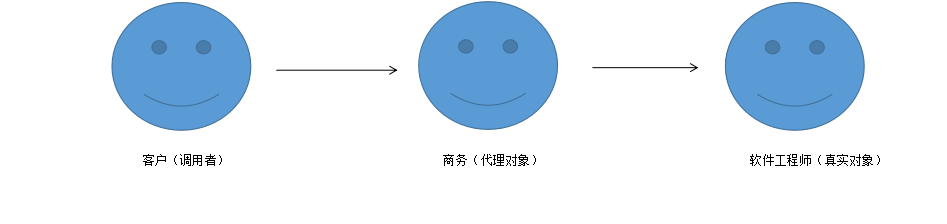

## 第二章 Java设计模式

### Java反射技术

- 它能够配置：类的全限定名，方法和参数，完成对象的初始化，甚至是反射某些方法。这样就可以大大增强Java的可配置性，Spring IOC的基本原理也是如此。

#### 通过反射构建对象

- ````java
  public class ReflectServiceImpl {
      public void sayHello(String name) {
          System.out.println("Hello "+name);
      }
  
  }
  ````

- 反射生成对象和反射调度方法

- ````java
  public class ReflectTest {
      public static void main(String[] args) {
          ReflectTest r = new ReflectTest();
          r.reflect();
  
      }
      public Object reflect() {
          ReflectServiceImpl object = null;
          try {
              object = (ReflectServiceImpl) Class.forName("com.ym.ssm.chapter2.reflect.ReflectServiceImpl")
                      .newInstance();
              Method method = object.getClass().getMethod("sayHello", String.class);
              method.invoke(object, "张三");
          } catch (NoSuchMethodException | SecurityException | ClassNotFoundException | IllegalAccessException
                  | IllegalArgumentException | InvocationTargetException | InstantiationException ex) {
              ex.printStackTrace();
          }
          return object;
      }
  
  }
  /*
  Hello 张三
  */
  ````

- 对象在反射机制下生成后，反射了方法，这样我们完全可以通过配置来完成对象和方法的反射，增强了Java的可配置性和可扩展性，其中**Spring IOC**就是一个典型。

### 动态代理模式和责任链模式

- 动态代理的意义在于生成一个占位(又称代理对象)，来代理真正对象，从而控制真实对象的访问。
- **什么是代理模式**：假设这样的一个场景，你的公司是一家软件公司，你是一位软件工程师。客户带着需求去找公司显然不会直接和你谈，而是去找商务谈，此时客户会认为商务就代表公司。



- **代理的作用**：在真实对象访问之前或者之后加入对应的逻辑，或者根据其他规则控制是否使用真实对象。
- 上面例子中商务控制了客户对软件工程师的访问。商务和软件工程师是代理和被代理的关系，客户是经过商务去访问软件工程师的。此时客户就是程序中的调用者，商务就是代理对象，软件工程师就是真实对象。需要在调用者调用对象之前产生一个代理对象，而这个代理对象需要和真实对象建立代理关系，所以代理必须分为两个步骤：
  1. 代理对象和真实对象建立代理关系。
  2. 实现代理对象的代理逻辑方法。
     1. 在**Java**中有多种动态代理技术，如：**JDK**,**CGLIB**,**Javassist**,**ASM**,最常用的动态代理技术有两种：
        1. 一种是**JDK**动态代理，这是**JDK**自带的功能。
        2. 另一种是**CGLIB**，这是第三方提供的技术，(**Spring**常用的是**JDK**和**CGLIB**，**MyBatis**使用了**Javassist**)

#### JDK动态代理

- JDK动态代理是**java.lang.reflect.***包提供的接口，它**必须借助一个接口**才能产生代理对象。

- ````java
  public interface HelloWorld {
      public void sayHelloWorld();
  }
  ````

- ````java
  public class HelloWorldImpl implements HelloWorld {
      @Override
      public void sayHelloWorld() {
          System.out.println("Hello World");
      }
  }
  ````

- 在**JDK**动态代理中，要实现代理逻辑类必须去实现**java.lang.reflect.InvocationHandler**接口，它提供了一个**invoke()**方法，并提供接口数组用于下挂代理对象。

- ````java
  public class JdkProxyExample implements InvocationHandler {
      //真实对象
      private Object target = null;
      /**
       * @param target 真实对象
       * @return 代理对象
       * */
      public Object bind(Object target) {
          this.target = target;
          return Proxy.newProxyInstance(target.getClass()
                  .getClassLoader(),target.getClass()
                  .getInterfaces(),this);
      }
      /**
       * @param proxy 代理对象
       * @param method 当前调度方法
       * @param args 当前方法参数
       * @return 代理结果返回
       * @throws Throwable 异常
       * */
      @Override
      public Object invoke(Object proxy, Method method, Object[] args) throws Throwable {
          System.out.println("进入代理逻辑方法");
          System.out.println("在调度真实对象之前的服务");
          //相当于调用sayHelloWorld方法
          Object obj = method.invoke(target,args);
          System.out.println("在调度真实对象之后的服务");
          return obj;
      }
  }
  ````

- **第一步**：建立代理对象和真实对象的关系。这里使用了**bind()**方法去完成，方法里面首先用类的属性**target**保存了真实对象，然后通过**newProxyInstance()**方法建立并生成代理对象。其中包含3个参数：

  1. 第一个是类加载器，我们采用**target**本身的类加载器。
  2. 第二个是把生成的动态代理对象下挂在那些接口下，这个写法就是放在**target**实现的接口下。**HelloWorldImpl**对象的接口显然就是**HelloWorld**,代理对象可以这样声明：`HelloWorld proxy = xxx`。
  3. 第三个是定义实现方法逻辑的代理类，**this**表示当前对象，他必须实现**InvocationHandler**接口的**invoke()**方法，他就是代理逻辑方法的实现方法。

- **第二步**：实现代理逻辑方法。**invoke()**方法可以实现代理逻辑，**invoke()**方法的3个参数如下：

  1. **proxy**：代理对象，就是**bind()**方法生成的对象。
  2. **method**:当前调度的方法。
  3. **args**:调度方法的参数。

  当我们使用了代理对象调度方法后，它就会进入到**invoke()**方法里面` Object obj = method.invoke(target,args)`。

- 类比之前的例子，**proxy**相当于商务对象，**target**相当于软件工程对象，**bind**方法就是建立商务和软件工程师代理关系的方法。而**invoke**就是商务逻辑。

- ````java
  public class TestJdkProxy {
      public static void main(String[] args) {
          JdkProxyExample jdk = new JdkProxyExample();
          //绑定关系，因为挂在接口HelloWorld下，所以声明代理对象HelloWorld proxy
          HelloWorld proxy = (HelloWorld) jdk.bind(new HelloWorldImpl());
          //注意：此时HelloWorld对象已经是一个代理对象，它会进入代理的逻辑方法invoke里proxy.sayHelloWorld();
          proxy.sayHelloWorld();
      }
  }
  /**
  进入代理逻辑方法
  在调度真实对象之前的服务
  Hello World
  在调度真实对象之后的服务
  */
  ````

#### CGLIB动态代理

- **CGLIB**动态代理的优势在于**不需要提供接口**，**只要一个非抽象类**就能实现动态代理。

- ````java
  import java.lang.reflect.Method;
  
  import net.sf.cglib.proxy.Enhancer;
  import net.sf.cglib.proxy.MethodInterceptor;
  import net.sf.cglib.proxy.MethodProxy;
  
  public class CglibProxyExample implements MethodInterceptor {
  	/**
  	 * 生成CGLIB代理对象
  	 * 
  	 * @param cls
  	 *            -- Class类
  	 * @return Class类的CGLIB代理对象
  	 */
  	public Object getProxy(Class cls) {
  		// CGLIB enhancer增强类对象
  		Enhancer enhancer = new Enhancer();
  		// 设置增强类型
  		enhancer.setSuperclass(cls);
  		// 定义代理逻辑对象为当前对象，要求当前对象实现MethodInterceptor方法
  		enhancer.setCallback(this);
  		// 生成并返回代理对象
  		return enhancer.create();
  	}
  
  	/**
  	 * 代理逻辑方法
  	 * 
  	 * @param proxy
  	 *            代理对象
  	 * @param method
  	 *            方法
  	 * @param args
  	 *            方法参数
  	 * @param methodProxy
  	 *            方法代理
  	 * @return 代理逻辑返回
  	 * @throws Throwable异常
  	 */
  	@Override
  	public Object intercept(Object proxy, Method method, Object[] args, MethodProxy methodProxy) throws Throwable {
  		System.err.println("调用真实对象前");
  		// CGLIB反射调用真实对象方法
  		Object result = methodProxy.invokeSuper(proxy, args);
  		System.err.println("调用真实对象后");
  		return result;
  	}
  }
  ````

- 此处使用了**CGLIB**的加强者**Enhancer**，通过设置超类的方法(**setSuperclass**)，然后通过**setCallback**方法设置哪个类为它的代理类。其中，参数为this就意味着是当前对象，那就要求用**this**这个对象实现接口**MethodInterceptor**的方法---**intercept**，然后返回代理对象。

- ````java
  public class TestCGLIBProxy {
      public static void main(String[] args) {
          CglibProxyExample cpe = new CglibProxyExample();
          ReflectServiceImpl obj = (ReflectServiceImpl)cpe.getProxy(ReflectServiceImpl.class);
          obj.sayHello("张三");
      }
  }
  /*
  调用真实对象前
  Hello 张三
  调用真实对象后
  */
  ````

#### 拦截器

- 由于动态代理一般比较难理解，程序设计者会设计一个拦截器接口供开发者使用，开发者只需要知道拦截器的方法，含义和作用即可，无须知道动态代理是怎么实现的。用JDK动态代理来实现一个拦截器的逻辑，为此先定义拦截器接口。

- ````java
  public interface Interceptor {
      /**
       * @param proxy 代理对象
       * @param target 真实对象
       * @param method 方法
       * @param args 运行方法参数
       * */
      public boolean before(Object proxy, Object target, Method method,Object[] args);
      
      public void around(Object proxy,Object target,Method method,Object[] args);
      
      public void after(Object proxy,Object target,Method method,Object[] args);
  }
  ````

- **before()**方法返回**boolean**值，他在真实对象前调用，当返回**true**时，则反射真实对象的方法：当返回**false**时，则调用**around()**方法。

- 在反射真实对象方法或者**around()**方法执行之后，调用**after()**方法。

- ````java
  public class MyInterceptor implements Interceptor {
      @Override
      public boolean before(Object proxy, Object target, Method method, Object[] args) {
          System.err.println("反射方法前逻辑");
          return false;   //不反射被代理对象原有方法
      }
  
      @Override
      public void around(Object proxy, Object target, Method method, Object[] args) {
          System.out.println("取代了被代理对象的方法");
      }
  
      @Override
      public void after(Object proxy, Object target, Method method, Object[] args) {
          System.out.println("反射方法后逻辑");
      }
  }
  ````

- 使用JDK动态代理，就可以去实现这些方法在适当时的调用逻辑了。

- ````java
  public class InterceptorJdkProxy implements InvocationHandler {
      private Object target;  //真实对象
      private String interceptorClass = null; //拦截器全限定名
  
      public InterceptorJdkProxy(Object target, String interceptorClass) {
          this.target = target;
          this.interceptorClass = interceptorClass;
      }
      /**
       * 绑定委托对象并返回一个【代理占位】
       * @param target 真实对象
       * @param interceptorClass 
       * @return 代理对象【占位】
       */
      public static Object bind(Object target,String interceptorClass) {
          //获得代理对象
          return Proxy.newProxyInstance(target.getClass().getClassLoader()
                  ,target.getClass().getInterfaces()
                  ,new InterceptorJdkProxy(target,interceptorClass));
      }
      /**
       * 
       * @param proxy
       * @param method
       * @param args
       * @return
       * @throws Throwable
       */
      @Override
      public Object invoke(Object proxy, Method method, Object[] args) throws Throwable {
          if (interceptorClass == null) {
              //没有设置拦截器则直接反射原有方法
              return method.invoke(target,args);
          }
          Object result = null;
          //通过反射生成拦截器
          Interceptor interceptor = (Interceptor)Class.forName(interceptorClass).newInstance();
          //调用前置方法
          if (interceptor.before(proxy,target,method,args)) {
              //反射原有对象方法
              result = method.invoke(target,args);
          }else { //返回false执行around()方法
              interceptor.around(proxy,target,method,args);
          }
          //调用后置方法
          interceptor.after(proxy,target,method,args);
          return result;
      }
  }
  ````

- 上面有两个属性：一个是**target**，它是一个真实对象；另一个是字符串**interceptorClass**,它是一个拦截器的全限定名。执行步骤。

  1. 第一步：在**bind()**方法中用**JDK**动态代理绑定了一个对象，然后返回代理对象。
  2. 第二步：如果没有设置拦截器，则直接反射真实对象的方法，然后结束，否则进行第3步。
  3. 第三步：通过反射生成拦截器，并准备使用它。
  4. 第四步：调用拦截器的**before()**方法，如果返回为**true**,反射原来的方法；否则运行拦截器的**around()**方法。
  5. 第五步：调用拦截器的**after()**方法。
  6. 第六步：返回结果。

- 拦截器可以进一步简化动态代理的使用方法，使程序变得更简单。

- ```java
  public class TestInterceptor {
      public static void main(String[] args) {
          HelloWorld proxy = (HelloWorld) InterceptorJdkProxy.bind(new HelloWorldImpl(),
                  "com.ym.ssm.chapter2.reflect.MyInterceptor");
          proxy.sayHelloWorld();
      }
  }
  /*
  反射方法前逻辑
  取代了被代理对象的方法
  反射方法后逻辑
  */
  ```

### 责任链模式

- 举个例子，一个程序员需要请假一周。如果把请假申请单看作一个对象，那么它需要经过项目经理，部门经理，人事等多个角色的审核，每个角色都有机会通过拦截这个申请单进行审核或者修改。

- 当一个对象在一条链上被多个拦截器拦截处理(拦截器也可以选择不拦截处理它)时，我们把这样的设计模式称为**责任链模式**，它用于一个对象在多个角色中传递的场景。

- 在上面的例子中，申请单到项目经理那，经理可能把申请时间“一周”改为“5天”，，从而影响了后面的审核，后面的审核都是根据前面的结果进行。这个时候可以考虑用层层代理来实现，就是当申请单(target)走到经理处，使用第一个动态代理**proxy1**。当它走到部门经理处，部门经理会得到一个在项目经理的代理**proxy1**基础上生成的**proxy2**来处理部门经理的逻辑。当它走到人事处时，会在**proxy2**的基础上生成**proxy3**。如果还有其他角色，以此类推。 

- 下面定义3个拦截器。

- ```java
  public class Interceptor1 implements Interceptor {
      @Override
      public boolean before(Object proxy, Object target, Method method, Object[] args) {
          System.out.println("拦截器1的before()方法");
          return true;
      }
  
      @Override
      public void around(Object proxy, Object target, Method method, Object[] args) {
  
      }
  
      @Override
      public void after(Object proxy, Object target, Method method, Object[] args) {
          System.out.println("拦截器1的after()方法");
      }
  }
  ```

- ```java
  public class Interceptor2 implements Interceptor {
      @Override
      public boolean before(Object proxy, Object target, Method method, Object[] args) {
          System.out.println("拦截器2的before()方法");
          return true;
      }
  
      @Override
      public void around(Object proxy, Object target, Method method, Object[] args) {
  
      }
  
      @Override
      public void after(Object proxy, Object target, Method method, Object[] args) {
          System.out.println("拦截器2的after()方法");
      }
  }
  ```

- ```java
  public class Interceptor3 implements Interceptor {
      @Override
      public boolean before(Object proxy, Object target, Method method, Object[] args) {
          System.out.println("拦截器3的before()方法");
          return true;
      }
  
      @Override
      public void around(Object proxy, Object target, Method method, Object[] args) {
  
      }
  
      @Override
      public void after(Object proxy, Object target, Method method, Object[] args) {
          System.out.println("拦截器3的after()方法");
      }
  }
  ```

- 在**TestInterceptor**中添加方法测试。

- ```java
  public static void test() {
  
          HelloWorld proxy1 = (HelloWorld) InterceptorJdkProxy.bind(new HelloWorldImpl(),
                  "com.ym.ssm.chapter2.reflect.Interceptor1");
          HelloWorld proxy2 = (HelloWorld) InterceptorJdkProxy.bind(proxy1,
                  "com.ym.ssm.chapter2.reflect.Interceptor2");
          HelloWorld proxy3 = (HelloWorld) InterceptorJdkProxy.bind(proxy2,
                  "com.ym.ssm.chapter2.reflect.Interceptor3");
          proxy3.sayHelloWorld();
  }
  /*
  拦截器3的before()方法
  拦截器2的before()方法
  拦截器1的before()方法
  Hello World
  拦截器1的after()方法
  拦截器2的after()方法
  拦截器3的after()方法
  */
  ```

- before()方法按照从最后一个拦截器到第一个拦截器的加载顺序运行，而after()方法按照从第一个拦截器到最后一个拦截器的加载顺序运行。

### 观察者模式

- 观察者模式又称之为**发布订阅模式**，观察者模式定义了一种**一对多**的依赖关系，让多个观察者对象同时监视着被观察者的状态。当被观察者的状态发生变化时，会通知所有的观察者，并让其自动更新自己。

#### 概述

- 在现实中，有些条件发生变化，其他的行为也需要发生变化，我们可以用if语句来应对。如：一个商家有一些产品，它和一些电商平台有合作，每当有新产品时，就会把这些产品推送到电商，现在只和淘宝，京东合作，于是：

- ````java
  if(产品库有新产品) {
  	推送产品到淘宝；
  	推送产品到京东；
  }
  ````

- 如果公司又和其他的平台合作，那么就需要改变这段代码

- ````java
  if(产品库有新产品) {
  	推送产品到淘宝；
  	推送产品到京东；
      推送产品到xxx;
      推送产品到xxx;
  }
  ````

- 按照这种方法，如果还和其他的平台合作，那么if的逻辑就会异常复杂了。如果推送商品给淘宝发生异常，需要捕捉异常，避免影响之后的电商接口，导致其不能往下进行，这样代码耦合就会增多，不利于维护，同时造成扩展困难。

- 而观察者模式更易于维护，责任也更加清晰，把每个电商接口看成一个观察者，每一个观察者都能观察到产品列表(被监听对象)。当公司发布新产品时，就会发送到这个产品列表上，于是产品列表(被监听对象)就发生了变化，这时就可以触发各个电商接口(观察者)发送新产品到对应的合作电商那里。

- 这样的好处在于，程序不在出现if语句，观察者会根据被观察对象的变化而做出对应的行为。

#### 实例

-  观察者模式要同时存在观察者和被观察者双方，观察者可以是多个。在Java中，需要去继承**java.util.Observable**类。

- ```java
  //被观察者
  public class ProductList extends Observable {
      //产品列表
      private List<String> productList = null;
      //类唯一实例
      private static ProductList instance;
      //构建方法私有化
      private ProductList() {}
  
      /**
       * 取得唯一实例
       * @return产品列表唯一实例
       */
      public static ProductList getInstance() {
          if (instance == null) {
              instance = new ProductList();
              instance.productList = new ArrayList<>();
          }
          return instance;
      }
  
      /**
       * 增加观察者(电商接口)
       * @param observer 观察者
       */
      public void addProductListObserver(Observer observer) {
          this.addObserver(observer);
      }
  
      /**
       * 新增产品
       * @param newProduct 新产品
       */
      public void addProduct(String newProduct) {
          productList.add(newProduct);
          System.out.println("产品列表新增了产品："+newProduct);
          this.setChanged();
          this.notifyObservers(newProduct);
      }
  }
  ```

- 构建方法私有化，避免通过**new**的方式创建对象，而是通过**getInstance()**方法获得产品列表单例，这里使用的是单例模式。

- 核心逻辑在**addProduct()**方法，在产品列表上增加了一个新的产品，然后调用**setChanged()**方法。这个方法用于告知观察者当前被观察者发生了变化，如果没有，则无法触发其行为。最后通过**notifyObservers()**告知观察者，让它们发生相应的动作，并将新产品作为参数传递给观察者。

- 作为观察者需要实现**java.util.Observer**接口的**update()**方法

- ```java
  public class JingDongObserver implements Observer {
      @Override
      public void update(Observable o, Object product) {
          String newProduct = (String)product;
          System.err.println("发送新产品"+product+"同步到京东商场");
      }
  }
  
  ```

- ````java
  public class TaoBaoObserver implements Observer {
      @Override
      public void update(Observable o, Object product) {
          String newProduct = (String)product;
          System.err.println("发送新产品"+product+"同步到淘宝商场");
      }
  }
  ````

- ```java
  public class ObserverTest {
      public static void main(String[] args) {
          ProductList instance = ProductList.getInstance();
          TaoBaoObserver taoBaoObserver = new TaoBaoObserver();
          JingDongObserver jingDongObserver = new JingDongObserver();
          instance.addObserver(taoBaoObserver);
          instance.addObserver(jingDongObserver);
          instance.addProduct("新增产品1");
      }
  }
  /*
  产品列表新增了产品：新增产品1
  发送新产品新增产品1同步到京东商场
  发送新产品新增产品1同步到淘宝商场
  */
  ```

### 建造者(Builder)模式

- 建造者模式属于对象的创建模式。可以将一个产品的内部表象(属性)与产品的生成过程分割开来，从而使一个建造过程具有不同的内部表象的产品对象。
- 在大部分情况下可以使用new或者工厂模式来创建对象，但是有些对象却比较复杂，比如：一些旅游票可以分为：普通成人票，退休老人，半价票等等，他们有着不同的规定和优惠。如果通过new或者工厂模式来创建对象会造成不便，因为需要参数太多，对象也复杂，显然构建套票所需数据异常复杂，导致套票对象的构建难以进行。
- Builder是一种分步构建对象的模式，以旅游套票为例，既然一次性构建套票对象有困难，那么就分步完成。

#### 实例

- 创建一个**TicketHelper**对象，它是配置类，帮我们一步一步完成构建对象。

- ```java
  public class TicketHelper {
      public void buildAdult(String info) {
          System.err.println("构建成人票逻辑"+info);
      }
      public void buildChildrenForSeat(String info) {
          System.err.println("构建有座儿童票逻辑"+info);
      }
      public void buildChildrenNoSeat(String info) {
          System.err.println("构建无座儿童票系统"+info);
      }
      public void buildElderly(String info) {
          System.err.println("构建有老人票逻辑"+info);
      }
      public void buildSoldier(String info) {
          System.err.println("构建军人及其家属票逻辑"+info);
      }
  }
  ```

- 创建构建类**TicketBuilder**。

- ```java
  public class TicketBuilder {
      public static Object builder(TicketHelper helper) {
          System.out.println("通过TicketHelper构建套票信息");
          return null;
      }
  }
  ```

- ```java
  public class BuilderDemo {
      public static void main(String[] args) {
          TicketHelper helper = new TicketHelper();
          helper.buildAdult("成人票");
          helper.buildChildrenNoSeat("有座儿童");
          helper.buildChildrenNoSeat("无座儿童");
          helper.buildElderly("老人票");
          helper.buildSoldier("军人票");
          Object ticket = TicketBuilder.builder(helper);
      }
  }
  ```

- 

