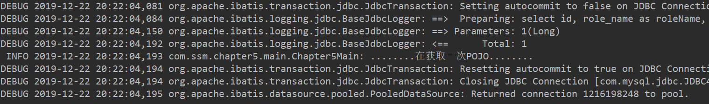

## 第五章 映射器

- 映射器是**MyBatis**中最复杂且最重要的组件。它有一个接口加上一个**XML**文件(或**注解**)组成。**在映射器中可以配置参数，各类的SQL语句，存储过程，缓存，级联等复杂的内容。**
- **MyBatis**的映射器也可以使用注解完成，但是它在企业应用中不多，原因主要有3个：
  1. **面对复杂性，SQL会显得无力，尤其是长SQL。**
  2. **注解的可读性较差。**
  3. **注解丢失了XML上下文相互引用的功能。**

### 概述

- 映射器的配置元素

| 元素名称         | 描述                                                         | 备注                                              |
| ---------------- | ------------------------------------------------------------ | ------------------------------------------------- |
| **select**       | 查询语句，最常用，最复杂的元素之一                           | 可以自定义参数，返回结果集等                      |
| **insert**       | 插入语句                                                     | 执行后返回一个整数，代表插入的条数                |
| **update**       | 更新语句                                                     | 执行后返回一个整数，代表更新的条数                |
| **delete**       | 删除语句                                                     | 执行后返回一个整数，代表删除的条数                |
| ~~parameterMap~~ | 定义参数映射关系                                             | 即将被删除的元素，不建议使用                      |
| **sql**          | 允许定义一部分SQL，然后在各个地方引用它                      | 如，一张表列名，一次定义，可以在多个SQL语句中使用 |
| **resultMap**    | 用来描述从数据库结果集中来加载对象，它是最复杂，最强大的元素 | 它将提供映射规则                                  |
| **cache**        | 给定命名空间的缓存配置                                       | ——                                                |
| **cache-ref**    | 其他命名空间缓存配置的引用                                   |                                                   |

### select元素-查询语句

- select元素的配置

| 元素          | 说明                                                         | 备注                                                         |
| ------------- | ------------------------------------------------------------ | ------------------------------------------------------------ |
| id            | 它和Mapper的命名空间组合起来是唯一的，供MyBatis使用          | 如果命名空间和id结合起来不唯一，MyBatis将抛出异常            |
| parameterType | 可以给出类的全类名，也可以给出别名，但是别名必须是MyBatis内部定义或自定义的 | 可以选择Java Bean，Map等简单的参数类型传递给SQL              |
| parameterMap  | 即将废弃的元素                                               |                                                              |
| resultType    | 定义类的全路径，在允许自动匹配的情况下，结果集将通过Java Bean的规范映射；或定义为int,double,float,map等参数；也可以使用别名，但是要符合别名规范，且不能和resultMap同时使用 | 常用的参数之一，比如统计总条数时可以把它的值设置为int        |
| resultMap     | 它是映射集的引用，将执行强大的映射功能。我们可以使用resultType和resultMap其中的一个，resultMap能提供自定义映射规则的机会 | MyBatis最复杂的元素，可以配置映射规则，级联，typeHandler等。 |
| flushCache    | 它的作用是在调用SQL后，是否要求MyBatis清空之前查询本地缓存和二级缓存 | 取值为布尔值，默认为false                                    |
| useCache      | 启动二级缓存的开关，是否要求MyBatis将此次结果缓存            | 取值为布尔型，默认false                                      |
| timeout       | 设置超时参数，超时时将抛出异常，以秒为单位                   | 默认值是数据库厂商提供的JDBC驱动所设置的秒数                 |
| fetchSize     | 获取记录的总条数设定                                         | 默认值是数据库厂商提供的JDBC驱动所设置的条数                 |
| resultSetType | 这是对JDBC的resultSet接口而言，它的值包括FORWARD_ONLY(游标允许向前访问),SCROLL_SENSITIVE(双向滚动，但不及时更新，就是如果数据库里的数据修改过，并不在resultSet中反应出来),SCROLL_INSENSITIVE(双向滚动，并及时跟踪数据库的更新，以便更改resultSET中的数据) | 默认值是数据库厂商提供的JDBC驱动所设置的                     |
| statementType | 告诉MyBatis使用哪个JDBC的Statement工作，取值为STATEMENT(Statement),PREPARED(PreparedStatement),CALLABLE(CallableStatement) | 默认值为PREPARED                                             |
| databaseId    | 前面第四章介绍过                                             | 提供多种数据库支持                                           |
| resultOrdered | 这个设置仅适用于嵌套结果select语句。如果为true，就是假设包含了嵌套结果集或是分组了，当返回一个主结果行时，就不能引用前面的结果集了。这就确保了在获取嵌套的结果集时不至于导致内存不够用 | 取值为布尔型，默认值为false                                  |
| resultSets    | 适合于多个结果集的情况，它将列出执行SQL后每个结果集的名称，每个名称之间用逗号分隔 | 较少使用                                                     |


#### 自动映射和驼峰映射

- **MyBatis**提供了自动映射功能，在**默认的情况下自动映射功能是开启**的，使用它的好处在于能有效**较少大量的映射配置**，从而减少工作量。

- 在**settings**元素中有两个可以配置的选项**autoMappingBehavior**和**mapUnderscoreToCamelCase**，它们是控制**自动映射**和**驼峰映射**的开关。一般而言，自动映射会使用的多一些。

- 配置自动映射的**autoMappingBehavior**选项的取值范围是：

  - **NONE**，不进行自动映射。
  - **PARTIAL**，默认值，只对没有进行嵌套结果集进行自动映射。
  - **FULL**，对所有的结果集进行自动映射，包括嵌套结果集。

- 第一步定义POJO

  - ```java
    public class Role {
        private Long id;
        private String roleName;
        private String note;
        //setting&getting
    }
    ```

- 第二步定义映射配置文件

  - ```xml
    <select id="getRole" parameterType="long" resultType="com.ssm.chapter5.pojo.Role">
    		select id,
    		role_name as roleName, note from t_role where id = #{id}
    	</select>
    ```

- 原来的列名**role_name**被**roleName**代替，这样就和**POJO**上的属性名保持一致。此时**MyBatis**就会将这个结果映射到**POJO**的属性**roleName**上，自动完成映射，而无须再进行任何配置。

- 如果系统严格按照驼峰命名法(如：数据库字段为**role_name**,则**POJO**属性名为**roleName**,数据库字段名为**user_name**，则**POJO**属性名为**userName**)，那么只要在配置项把**mapUnderscoreToCamelCase**设置为**true**即可。那么**SQL**可以改写为：

  - ```sql
    select id, role_name, note from t_role where id = #{id}
    ```

- **MyBatis**会**严格按照驼峰命名的方式做自动映射**，只是这样会要求数据库字段和**POJO**的属性名严格对应，**降低了灵活性**。

#### 传递多个参数

- 在现实中的需求中可能有多个参数，比如：订单可以通过订单编号查询，也可以根据订单名称，日期或者价格等参数进行查询，为此要传递多个参数，假设要通过角色名称(**role_name**)和备注(**note**)对角色进行模糊查询，这样就有了两个参数。

##### 使用map接口传递参数

- 在**MyBatis**中允许使用**map**接口通过键值对传递多个参数，定义接口方法。

  - ```java
    public List<Role> findRolesByMap(Map<String,Object> parameterMap);
    ```

- 配置**XML**文件

  - ```xml
    <select id="findRolesByMap" parameterType="map" resultType="role">
    		select id, role_name as roleName, note from t_role
    		where role_name like
    		concat('%', #{roleName}, '%')
    		and note like concat('%', #{note}, '%')
    	</select>
    ```

- 注意：参数**roleName**和**note**，要求的是**map**的键。

- 添加测试类

  - ```java
    @Test
    	public void testFindRolesByMap() {
    		SqlSession sqlSession = null;
    		try {
    			sqlSession = SqlSessionFactoryUtils.openSqlSession();
    			RoleMapper roleMapper = sqlSession.getMapper(RoleMapper.class);
    			Map<String, Object> parameterMap = new HashMap<String, Object>();
    			parameterMap.put("roleName", "1");
    			parameterMap.put("note", "1");
    			List<Role> roles = roleMapper.findRolesByMap(parameterMap);
    			System.out.println(roles.size());
    		} catch(Exception ex) {
    			ex.printStackTrace();
    		} finally {
    			if (sqlSession != null) {
    				sqlSession.close();
    			}
    		}
    	}
    ```

- 在**SQL**中的参数标识将会被这里设置的参数所取代，这样就能够运行了。但是**map**适用的场景不多，原因如下：

  - **map**是一个键值对应的集合，使用者要通过阅读它的键，才能明白其作用。
  - 使用**map**不能限定其传递的数据类型，因此业务性质不强，可读性差。

##### 使用注解传递多个参数

- **MyBatis**为开发者提供了一个注解**@Param**(org.apache.ibatis.annotations.Param)，通过它去定义映射器的参数名称，使用它可以得到更好的可读性。

- 定义接口

  - ```java
    public List<Role> findRoleByAnnotation(@Param("roleName") String rolename,@Param("note") String note);
    ```

- 配置XML文件

  - ```xml
    <select id="findRoleByAnnotation" resultType="role">
    	select id, role_name as roleName, note from t_role where role_name like concat('%', #{roleName}, '%') and note like concat('%', #{note}, '%')
    </select>
    ```

- 添加测试

  - ```java
    @Test
    	public void testFindRolesByAnnotation() {
    		SqlSession sqlSession = null;
    		try {
    			sqlSession = SqlSessionFactoryUtils.openSqlSession();
    			RoleMapper roleMapper = sqlSession.getMapper(RoleMapper.class);
    			List<Role> roles = roleMapper.findRolesByAnnotation("1", "1");
    			System.out.println(roles.size());
    		} catch(Exception ex) {
    			ex.printStackTrace();
    		} finally {
    			if (sqlSession != null) {
    				sqlSession.close();
    			}
    		}
    	}
    ```

- 注意：此时并不需要给出**parameterType**属性，让**MyBatis**自动探索就可以了。

- 但是如果**SQL**很复杂，用于大于**10**个参数，那么接口方法的参数个数就多了，使用起来就很不容易了。不过**MyBatis**还提供了传递**Java Bean**的形式。

##### 通过Java Bean传递多个参数

- 定义实体类

  - ```java
    public class RoleParams {
        public String roleName;
       	public String note;
       	//setting && getting
    }
    ```

- 定义接口

  - ```java
    public List<Role> findRolesByBean(RoleParams roleParam);
    ```

- 配置XML文件

  - ```xml
    <select id="findRolesByBean" parameterType="xxx.xxx.xxx.RoleParams" resultType="role">
    	select id role_name as roleName, note from t_role where role_name like concat('%', #{roleName}, '%') and note like concat('%', #{note}, '%')
    </select>
    ```

- 添加测试

  - ```java
    @Test
    	public void testFindRolesByBean() {
    		SqlSession sqlSession = null;
    		try {
    			sqlSession = SqlSessionFactoryUtils.openSqlSession();
    			RoleMapper roleMapper = sqlSession.getMapper(RoleMapper.class);
    			RoleParams roleParam = new RoleParams();
    			roleParam.setNote("1");
    			roleParam.setRoleName("1");
    			List<Role> roles = roleMapper.findRolesByBean(roleParam);
    			System.out.println(roles.size());
    		} catch(Exception ex) {
    			ex.printStackTrace();
    		} finally {
    			if (sqlSession != null) {
    				sqlSession.close();
    			}
    		}
    	}
    ```

##### 混合配置

- 在某些情况下可能需要使用几种方式来传递参数，如查询一个角色，可以通过角色名称和备注进行查询，与此同时还需要支持分页。

- 定义分页实体类

  - ```java
    public class PageParams {
        private int start;
        private int limit;
        //setting && getting
    }
    ```

- 定义接口

  - ```java
    public List<Role> findByMix(@Param("Params") RoleParams roleParams,@Params("page") PageParams pageparam)
    ```

- 配置XML映射文件

  - ```xml
    <select id="findByMix" resultType="role">
    		select id, role_name as
    		roleName, note from t_role
    		where role_name like
    		concat('%',
    		#{params.roleName}, '%')
    		and note like concat('%', #{params.note}, '%')
    		limit #{page.start}, #{page.limit}
    	</select>
    ```

- 添加测试

  - ```java
    @Test
    	public void testFindByMix() {
    		SqlSession sqlSession = null;
    		try {
    			sqlSession = SqlSessionFactoryUtils.openSqlSession();
    			RoleMapper roleMapper = sqlSession.getMapper(RoleMapper.class);
    			RoleParams roleParam = new RoleParams();
    			roleParam.setNote("n");
    			roleParam.setRoleName("r");
    			PageParams pageParams = new PageParams();
    			pageParams.setStart(0);
    			pageParams.setLimit(100);
    			List<Role> roles = roleMapper.findByMix(roleParam, pageParams);
    			System.out.println(roles.size());
    			for (Role role : roles) {
    				System.out.println(role);
    			}
    		} catch(Exception ex) {
    			ex.printStackTrace();
    		} finally {
    			if (sqlSession != null) {
    				sqlSession.close();
    			}
    		}
    	}
    ```

##### 总结

1. 使用**map**传递参数导致了业务可读性的丧失，导致后续扩展性和维护性的困难，在实际的应用中要果断废弃这种方式。
2. 使用**@Param**注解传递多个参数，受到参数个数(n)的影响。当**n<=5**时，这是最佳的传参方式，当**n>=5**时，多个参数将给调用带来困难，此时不推荐使用它。
3. 当参数个数多于**5**个时，建议使用**Java Bean**方式。
4. 当使用混合参数的，要明确参数的合理性。

#### 使用resultMap映射结果集

- 之前介绍的自动映射和驼峰映射比较简单，无法定义太多的属性，比如：**typeHandler**，**级联**等。为了支持复杂的映射，**select**提供了**resultMap**属性。

  - ```xml
    <mapper namespace="com.ssm.chapter5.mapper.RoleMapper">
        <resultMap id="roleMap" type="role">
                <id property="id" column="id" />
                <result property="roleName" column="role_name" />
                <result property="note" column="note" />
            </resultMap>
    
            <select id="getRoleUseResultMap" parameterType="long" resultMap="roleMap">
                select id, role_name, note from t_role where id = #{id}
            </select>
    </mapper>
    ```

- **resultMap**元素定义了一个**roleMap**，它的属性**id**表示代表它的**标识**，**type**表示使用的是哪个类作为其映射的类，可以是**全限定名**或**别名**。

- 它的子元素**id**代表**resultMap**的主键，而**result**代表其属性，**id**和**result**元素的属性**property**代表**POJO**的属性名称，而**column**代表**SQL**的列名，从而建立**POJO**与**SQL**的映射。

- 在**select**元素中的属性**resultMap**制定了采用哪个**resultMap**作为其映射规则。

#### 分页参数RowBounds

- **MyBatis**中内置了一个专门处理分页的类**RowBounds**。

  - ```java
    package org.apache.ibatis.session;
    
    public class RowBounds {
        public static final int NO_ROW_OFFSET = 0;
        public static final int NO_ROW_LIMIT = 2147483647;
        public static final RowBounds DEFAULT = new RowBounds();
        private int offset;
        private int limit;
    
        public RowBounds() {
            this.offset = 0;
            this.limit = 2147483647;
        }
    
        public RowBounds(int offset, int limit) {
            this.offset = offset;
            this.limit = limit;
        }
    
        public int getOffset() {
            return this.offset;
        }
    
        public int getLimit() {
            return this.limit;
        }
    }
    ```

- **offset**属性是**偏移量**，即从第几行开始读取记录，**limit**是限制条数，默认值为**0~2147483647**，使用十分简单，只要给接口增加一个**RowBounds**参数即可。

  - ```java
    public List<Role> findByRowBounds(@Param("roleName") String rolename,@Param("note") String note,RowBounds rowBounds);
    ```

- 编写**XML**映射文件，不需要**RowBounds**

  - ```xml
    <select id="findByRowBounds" resultType="role">
    	select id, role_name as roleName, note from t_role where role_name like concat('%', #{roleName}, '%') and note like concat('%', #{note}, '%')
    </select>
    ```

- 添加测试

  - ```java
    @Test
    	public void testFindByRowBounds() {
    		SqlSession sqlSession = null;
    		try { sqlSession = SqlSessionFactoryUtils.openSqlSession();
    		RoleMapper roleMapper = sqlSession.getMapper(RoleMapper.class);
    		RowBounds rowBounds = new RowBounds(0,20);
    		List<Role> roleList = roleMapper.findByRowBounds("role_name", "note", rowBounds);
    		System.err.println(roleList.size());
    			System.err.println(roleList);
    		}catch (Exception e) {
    			e.printStackTrace();
    		}finally {
    			if (sqlSession != null) {
    				sqlSession.close();
    			}
    		}
    	}
    ```

- **RowBounds**分页运用的场景，它只能运用于一些小数据量的查询。**RowBounds**分页的原理是执行**SQL**的查询后，按照偏移量和限制条数返回查询结果，所以对于大量的数据查询，它的性能并不佳。

### insert元素-插入语句

- insert元素的配置

| 属性                 | 描述                                                         | 备注                                                         |
| -------------------- | ------------------------------------------------------------ | ------------------------------------------------------------ |
| **id**               | **SQL**编号，用于标识这条**SQL**                             | 命名空间+**id**+**databaseId**唯一，否则**MyBatis**会抛出异常 |
| **parameterType**    | 参数类型                                                     | 和**select**一样，可以是单个参数或者多个参数                 |
| ~~**parameterMap**~~ | 参数的**map**，即将废弃                                      |                                                              |
| **flushCache**       | 是否刷新缓存，可以配置**true/false**，为**true**时，插入时会刷新一级和二级缓存，否则不刷新 | 默认值为**true**                                             |
| **timeout**          | 超时时间，单位为秒                                           |                                                              |
| **statementType**    | **STATEMENT**,**PREPARED**或**CALLABLE**中的一个。这会让**MyBatis**分别使用**Statement**，**PreparedStatement**(预编译)或**CallableStatement**(存储过程) | 默认值为**PREPARED**                                         |
| **useGeneratedKeys** | 是否开启**JDBC**的**getGeneratedKeys**方法来取出由数据库内部生成的主键(比如**MySQL**和**SQL Server**这样的数据库表的自增主键) | 默认值为**false**                                            |
| **keyProperty**      | (仅对**insert**和**update**有用)唯一标识一个属性，**MyBatis**会通过**getGeneratedKeys**的返回值，或者通过**insert**语句的**selectKey**子元素设置它的键值。如果是符合主键，要把每一个名称用逗号(，)隔开 | 默认值为**unset**。不能和**keyColumn**连用                   |
| **keyColumn**        | (仅对**insert**和**update**有用)唯一标识一个属性，**MyBatis**会通过**getGeneratedKeys**的返回值，或者通过**insert**语句的**selectKey**子元素设置它的键值，如果是复合主键，要把每一个名称用逗号(,)隔开 | 不能和**keyProperty**连用                                    |
| **databaseId**       | 上一章介绍过                                                 |                                                              |

- **MyBatis**在执行完一条**insert**语句后，会返回一个整数表示其影响的记录数。

#### 简单的insert语句的应用

- ```xml
  <insert id="insertRole" parameterType="role">
  		insert into t_role(role_name, note) values(#{roleName},
  		#{note})
  	</insert>
  ```

#### 主键回填

- 上面的代码它并没有插入**id**列，因为**MySQL**中的表格采用了**自增主键**。

- **JDBC**中的**Statement**对象在执行插入的**SQL**后，可以通过**getGeneratedKeys**方法获得数据库生成的主键(需要数据库驱动的支持)，这样便能达到主键的功能。在**insert**语句中有一个开关属性**useGeneratedKeys**，用来控制是否打开这个功能，它的默认值是**false**。当打开了这个开关，还要配置其属性**keyProperty**或**keyColumn**，告诉系统把生成的主键放在哪个属性中，如果存在多个主键，就要用逗号(,)将它们隔开。

- 编写接口

  - ```java
    public int insertRole(Role role);
    ```

- 配置**xml**映射文件

  - ```xml
    <insert id="insertRole" parameterType="role" useGeneratedKeys="true"
    		keyProperty="id">
    		insert into t_role(role_name, note) values(#{roleName},
    		#{note})
    	</insert>
    ```

- **useGeneratedKeys**代表采用**JDBC**的**Statement**对象的**getGeneratedKeys**方法返回主键，而**keyProperty**则代表将用哪个**POJO**的属性去匹配这个主键。此处是id。

- 添加测试

  - ```java
    @Test
    	public void testInsertRole() {
    		SqlSession sqlSession = null;
    		try {
    			sqlSession = SqlSessionFactoryUtils.openSqlSession();
    			RoleMapper roleMapper = sqlSession.getMapper(RoleMapper.class);
    			Role role = new Role();
    			role.setRoleName("role_name_5");
    			role.setNote("note_5");
    			roleMapper.insertRole(role);
    			//����
    			System.out.println(role.getId());
    			sqlSession.commit();
    		} catch(Exception ex) {
    			sqlSession.rollback();
    			ex.printStackTrace();
    		} finally {
    			if (sqlSession != null) {
    				sqlSession.close();
    			}
    		}
    	}
    ```

#### 自定义主键

- 有时候主键可能依赖于某些规则，比如取消角色表(**r_role**)的**id**递增规则，而将其规则修改为：
  - 当角色表记录为空时，**id**设置为**1**。
  - 当角色表记录不为空时，**id**设置为当前**id**加3

- **MyBatis**对这样的场景也提供了支持，它主要依赖于**selectKey**元素进行支持，它允许自定义键值的生成规则。

  - ```xml
    <insert id="insertRole" parameterType="role">
    	<selectKey keyProperty="id" resultType="long" order="BEFORE">
        	select if (max(id) = null, 1, max(id) + 3) from t_role
        </selectKey>
        insert into t_role(id, role_name, note) values(#{id}, #{roleName}, #{note})
    </insert>
    ```

- **selectKey**元素，它的**keyProperty**指定了采用哪个属性作为**POJO**的主键，**resultType**告诉**MyBatis**将返回一个**long**型的结果集，而**order**设置为**BEFORE**，说明它将于当前定义的**SQL**前执行。

### update和delete元素

- 它们和**insert**的属性差不多，执行完也会返回一个整数，用于标识该**SQL**语句影响了数据库的记录行数。

  - ```xml
    <update id="updateRole" parameterType="role">
    		update t_role set role_name = #{roleName}, note = #{note}
    		where id = #{id}
    	</update>
    	
    	<delete id="deleteRole" parameterType="long">
    		delete from t_role where id = #{id}
    	</delete>
    ```

### sql元素

- **sql**元素的作用在于可以定义一条**SQL**的一部分，方便后面的**SQL**引用它，比如最典型的列名，而在**MyBatis**中只需要使用**sql**元素编写一次便能在其他元素中引用它。

  - ```xml
    <sql id="roleCols">
    	id, role_name, note
    </sql>
    <select id="getRole" parameterType="long" resultMap="roleMap">
    	select <include refid="roleCols"/> from t_role where id = #{id}
    </select>
    ```

- 通过**sql**元素进行了定义，就可以通过**include**元素引入到各条**SQL**中了。这样的代码，在字段多的数据库表中可以重复使用。

- **sql**元素还支持变量传递

  - ```xml
    <sql id="roleCols">
    	${alias}.id, ${alias}.role_name, ${alias}.note
    </sql>
    <select id="getRole" parameterType="long" resultMap="roleMap">
    	select
    <include refid="roleCols">
        		<property name="alias" value="r"/>
    </include>
        from t_role r where id = #{id}
    </select>
    ```

- 在**include**元素中定义了一个命名为**alias**的变量，其值是**SQL**表中**t_role**的别名**r**，然后**sql**元素就能够使用这个变量名了。

### 参数

#### 概述

- 一些数据库字段返回为**null**，而**MyBatis**系统又检测不到使用了何种**jdbcType**进行处理时，会发生异常的情况这个时候执行对应的**typeHandler**进行处理，**MyBatis**就知道采取哪个**typeHandler**进行处理了，如：

  - ```xml
    insert into t_role(id, role_name, note) values(#{id}, #{roleName,typeHandler=org.apache.ibatis.type.StringTypeHandler},#{note})
    ```

- 大部分情况下都不需要这样编写，因为**MyBatis**会根据**javaType**和**jdbcType**去检测使用了哪个**typeHandler**。如果**roleName**是一个没有注册的类型，那么就会发生异常。因为**MyBatis**无法找到对应的**typeHandler**来转换数据类型。此时可以自定义**typeHandler**，通过类似的方法指定，就不会出现异常了。在一些因为数据库返回返回为**null**，存在可能抛出异常的情况下，也可以指定对应的**jdbcType**，从而让**MyBatis**能够探测到使用哪个**typeHandler**进行转换，以避免空指针异常，如：

  - ```xml
    #{age,javaType=int,jdbcType=NUMERIC,typeHandler=MyTypeHandler}
    ```

- **MyBatis**也提供了一些对控制数值的精度支持，如下：

  - ```xml
    #{width,javaType=double,jdbcType=NUMERIC,numericScale=2}
    ```

- 这样**MyBatis**就会控制这个精度，只保留数字的两位有效位。

#### 存储过程参数支持

- MyBatis对存储过程也进行了支持，在存储过程中存在：**输入(IN)参数**，**输出(OUT)参数**和**输入输出(INOUT)参数**三种类型。

  - 输入参数是外界需要传递给存储过程的。
  - 输出参数是存储过程经过处理后返回的。
  - 输入输出参数一方面外界需要可以传递给它，另一方面在最后存储过程也会将它返回给调用者。

- 对于简单的输出参数(比如：INT，VARCHAR,DECIMAL)可以使用POJO通过映射来完成。存储过程的参数类型有3种。

  - ```xml
    #{id, mode=IN}
    #{roleName, mode=OUT}
    #{note, mode=INOUT}
    ```

### resultMap元素

- **resultMap**的作用是**定义映射规则，级联的更新，定制类型转换器等**，**resultMap**定义的主要是一个结果集的映射关系，也就是**SQL**到**Java Bean**的映射关系定义。它也**支持级联**等特性(只是在**MyBatis**现有的版本只支持**resultMap**查询)

#### resultMap元素的构成

```xml
<resultMap>
	<constructor>
    	<idArg/>
        <arg/>
    </constructor>
    <id/>
    <result/>
    <association/>
    <collection/>
    <discriminator>
    	<case/>
    </discriminator>
</resultMap>
```

- **constructor**元素用于配置构造方法。一个**POJO**可能不存在没有参数的构造方法，可以使用**constructor**进行配置。

- 假设角色类**RoleBean**不存在没有参数的构造方法，它的构造方法声明为**public RoleBean(Integer id,String roleName)**，那么需要配置结果集，代码如下。

  - ```xml
    <resultMap>
        <constructor>
            <idArg column="id" javaType="int"/>
            <arg column="role_name" javaType="string"/>
        </constructor>
    </resultMap>
    ```

  - **id**元素表示哪个列是主键，允许多个主键，多个主键则称为联合主键。**resultMap**是配置**POJO**到**SQL**列名的映射关系。**result**元素和**idArg**元素用法如下：

    | 元素名称        | 说明                                                         | 备注                                                         |
    | --------------- | ------------------------------------------------------------ | ------------------------------------------------------------ |
    | **property**    | 映射到列结果的字段或属性。如果**POJO**的属性匹配的是存在的且与给定**SQL**列名(**column**元素)相同的，那么**MyBatis**就会映射到**POJO**上 | 可以使用导航式的字段，比如访问一个学生对象需要访问学生证的发证日期，那么可以写成**selfcard.issueDate** |
    | **column**      | 对应的是**SQL**的列                                          |                                                              |
    | **javaType**    | 配置**java**的类型                                           | 可以是特定的类完全限定名或者**MyBatis**的上下文的别名        |
    | **jdbcType**    | 配置数据库类型                                               | 这是一个**JDBC**的类型，**MyBatis**已经做了限定，支持大部分常用的数据库类型 |
    | **typeHandler** | 类型处理器                                                   | 允许用特定的处理器来覆盖**MyBatis**默认的处理器。这就要制定**jdbcType**和**javaType**相互转换的规则 |


#### 使用map存储结果集

- 一般情况下，任何**select**语句都可以使用**map**存储

  - ```xml
    <select id="findColorByNote" parameterType="string" resultType="map">
    	select id,color,note from t_color where note like concat('%', #{note}, '%')
    </select>
    ```

- 使用**map**接口就意味着可读性的下降，因为使用**map**接口时需要进一步了解**map**键值的构成和数据类型，因此这种方式不推荐，更多时候使用的是**POJO**方式。

#### 使用POJO存储结果集

- **POJO**是最常用的方式，一方面可以使用**自动映射**，正如**resultType**属性一样，但是有时候需要更为复杂的映射或者级联，这个时候还可以使用**select**的**resultMap**属性配置映射集合，只是使用前要配置类似的**resultMap**。

- ```xml
  <resultMap type="com.ssm.chapter5.pojo2.Role" id="roleMapper">
  		<id column="id" property="id" />
  		<result column="role_name" property="roleName" />
  		<result column="note" property="note" />
  	</resultMap>
  ```

- **resultMap**元素的属性**id**代表这个**resultMap**的标识，**type**代表着需要映射的**POJO**，这里可以使用**MyBatis**定义好的类的别名，也可以使用自定义的类的全限定名。

- 在映射关系中，**id**元素表示这个对象的主键，**property**代表着**POJO**的属性名称，**column**表示数据库**SQL**的列名，于是**POJO**与**SQL**的结果就一一对应起来了。

- 使用定义好的**resultMap**

- ```xml
  <select id="getRole" resultMap="roleMapper" parameterType="long">
  	select * from t_role where id = #{id}
  </select>
  ```

- 注：配置了**resultMap**就不能再配置**resultType**了。

### 级联

#### 概述

- 级联是**resultMap**中的元素，他比较复杂。
- 级联是一个是数据库实体的概念。比如角色就需要存在用户与之对应，这样便有了角色用户表，一个角色可能有多个用户，这就是**一对多**的级联，除此之外，还有**一对一**级联。
- 在**MyBatis**中还有一种被称为**鉴别器**的级联，**它是一种可以选择具体实现类的级联**。
- 级联不是必须的，级联的好处是获取关联数据十分便捷，但是级联过多会增加系统的复杂度，同时降低系统的性能，所以当级联数据层级超过3层时，就不要考虑使用级联了，因为这样会造成多个对象的关联，导致系统的耦合，复杂和难以维护。

#### MyBatis中的级联

- **MyBatis**中的级联分为3种。
  - **鉴别器**(discriminator)：它是一个根据某些条件决定采用具体实现类级联的方案，比如体检表要根据性别区分。
  - **一对一**(association)：比如人和身份证。
  - **一对多**(collection)：班级与学生。
- 注：在**MyBatis**中**不支持多对多**级联，因为多对多级联比较复杂，使用困难，而且可以通过两个一对多级联进行替换，所以**MyBatis**不支持多对多级联。

#### 配置映射文件

- 配置映射文件是级联的核心内容。

- TaskMapper.xml

  - ```xml
    <mapper namespace="com.ssm.chapter5.mapper.TaskMapper">
        <select id="getTask" parameterType="long" resultType="com.ssm.chapter5.pojo.Task">
            select id, title, context, note from t_task where id = #{id}
        </select>
    </mapper>
    ```

- WorkCardMappers.xml

  - ```xml
    <mapper namespace="com.ssm.chapter5.mapper.WorkCardMapper">
        <select id="getWorkCardByEmpId" parameterType="long" resultType="com.ssm.chapter5.pojo.WorkCard">
            SELECT  id, emp_id as empId, real_name as realName, department, mobile, position, note FROM t_work_card
            where emp_id = #{empId} 
        </select>
    </mapper>
    ```

- 雇员任务表通过任务编号(task_id)与任务表关联，这是一个一对一的级联关系，使用**association**元素，雇员任务表一对一级联如下。

- EmployeeTaskMapper.xml

  - ```xml
    <mapper namespace="com.ssm.chapter5.mapper.EmployeeTaskMapper">
    
        <resultMap type="com.ssm.chapter5.pojo.EmployeeTask" id="EmployeeTaskMap">
            <id column="id" property="id"/>
            <result column="emp_id" property="empId"/>
            <result column="task_name" property="taskName"/>
            <result column="note" property="note"/>
            <association property="task" column="task_id"
                select="com.ssm.chapter5.mapper.TaskMapper.getTask"/>
        </resultMap>
        
        <select id="getEmployeeTaskByEmpId" resultMap="EmployeeTaskMap">
            select id, emp_id, task_name, task_id, note from t_employee_task 
            where emp_id = #{empId}
        </select>
    </mapper>
    ```

- **association**元素代表着一对一级联的开始，。**property**属性代表映射到**POJO**属性上，**select**配置是命名空间+**SQL id**的形式，这样便可以指向对应**Mapper**的**SQL**，**MyBatis**就会通过对应的**SQL**将数据查询回来。**column**代表**SQL**的列，用作参数传递给**select**属性制定的**SQL**，如果是多个参数，则需要用逗号隔开。

- 体检表，它能拆分为男性雇员和女性雇员，所以就有了两个简单的映射器。

- MaleHealthFormMapper.xml

  - ```xml
    <mapper namespace="com.ssm.chapter5.mapper.MaleHealthFormMapper">
    	<select id="getMaleHealthForm" parameterType="long"
    		resultType="com.ssm.chapter5.pojo.MaleHealthForm">
    		select id, heart, liver, spleen, lung, kidney, prostate, note from
    		t_male_health_form where emp_id = #{id}
    	</select>
    </mapper>
    ```

- FemaleHealthFormMapper.xml

  - ```xml
    <mapper namespace="com.ssm.chapter5.mapper.FemaleHealthFormMapper">
    	<select id="getFemaleHealthForm" parameterType="long"
    		resultType="com.ssm.chapter5.pojo.FemaleHealthForm">
    		select id, heart, liver, spleen, lung, kidney, uterus, note from
    		t_female_health_form where emp_id = #{id}
    	</select>
    </mapper>
    ```

- 雇员的映射关系EmployeeMapper.xml

  - ```xml
    <mapper namespace="com.ssm.chapter5.mapper.EmployeeMapper">
    	<resultMap type="com.ssm.chapter5.pojo.Employee" id="employee">
    		<id column="id" property="id" />
    		<result column="real_name" property="realName" />
    		<result column="sex" property="sex"
    			typeHandler="com.ssm.chapter5.typeHandler.SexTypeHandler" />
    		<result column="birthday" property="birthday" />
    		<result column="mobile" property="mobile" />
    		<result column="email" property="email" />
    		<result column="position" property="position" />
    		<result column="note" property="note" />
    		<association property="workCard" column="id"
    			select="com.ssm.chapter5.mapper.WorkCardMapper.getWorkCardByEmpId" />
    		<collection property="employeeTaskList" column="id"
    select="com.ssm.chapter5.mapper.EmployeeTaskMapper.getEmployeeTaskByEmpId" />
    		<discriminator javaType="long" column="sex">
    			<case value="1" resultMap="maleHealthFormMapper" />
    			<case value="2" resultMap="femaleHealthFormMapper" />
    		</discriminator>
    	</resultMap>
    
    	<resultMap type="com.ssm.chapter5.pojo.FemaleEmployee" id="femaleHealthFormMapper"
    		extends="employee">
    		<association property="femaleHealthForm" column="id"
    			select="com.ssm.chapter5.mapper.FemaleHealthFormMapper.getFemaleHealthForm" />
    	</resultMap>
    
    	<resultMap type="com.ssm.chapter5.pojo.MaleEmployee" id="maleHealthFormMapper"
    		extends="employee">
    		<association property="maleHealthForm" column="id"
    			select="com.ssm.chapter5.mapper.MaleHealthFormMapper.getMaleHealthForm" />
    	</resultMap>
    
    	<select id="getEmployee" parameterType="long" resultMap="employee">
    		select
    		id, real_name as realName, sex, birthday, mobile, email, position,
    		note from t_employee where id = #{id}
    	</select>
    </mapper>
    ```

- **association**元素，对工牌进行一对一级联。

- **collection**元素，一对多级联，其**select**元素指向**SQL**，将通过**column**制定的**SQL**字段作为参数进行传递，然后将结果返回给雇员**POJO**的属性**employeeTaskList**。

- **discriminator**元素，鉴别器，它的属性**column**代表使用哪个字段进行鉴别，这里是**sex**，而它的子元素**case**，则用于进行区分，类似于**Java**的**switch...case...**语句。而**resultMap**属性表示采用哪个**ResultMap**进行映射，比如**sex=1**，则使用**maleHealthFormMapper**进行映射。

- 测试级联

  - ```java
    @Test
    	public void testGetEmployee() {
    		SqlSession sqlSession = null;
    		try {
    			Logger logger = Logger.getLogger(Chapter5Main.class);
    			sqlSession = SqlSessionFactoryUtils.openSqlSession();
    			EmployeeMapper employeeMapper = sqlSession.getMapper(EmployeeMapper.class);
    			Employee employee = employeeMapper.getEmployee(1L);
    			logger.info(employee.getBirthday());
    		} catch(Exception ex) {
    			ex.printStackTrace();
    		} finally {
    			if (sqlSession != null) {
    				sqlSession.close();
    			}
    		}
    	}
    ```

#### N+1问题

- 如果像上面那样取出所有属性，就会使数据库多执行几条毫无意义的**SQL**。如果需要在雇员信息系统中加入一个关联信息，那么它在默认情况下会执行**SQL**取出数据，而真实的需求往往只要完成雇员和雇员任务表的级联就可以了，不需要把所有信息加载都加载进，因为有些信息并不常用，加载它们会多加载几条毫无用处的**SQL**，导致数据库资源的损耗和性能的下降。
- 假设现在有**N**个关联关系完成了级联，那么只要再加入一个关联关系，就变成了**N+1**个级联，所有的级联**SQL**都会被执行，显然会有很多并不是我们关系的数据被取出，这样会造成很大的资源浪费，这就是**N+1**问题，尤其是在那些需要高性能的互联网系统中，这往往是不被允许的。
- 为了应对**N+1**问题，**MyBatis**提供了延迟加载功能，即在一开始取雇员信息时，并不需要将工牌表，体检表，任务表记录取出，而是只将雇员信息和雇员任务表的信息取出。当我们通过雇员**POJO**访问工牌表时，体检表和任务表的记录才通过对应的**SQL**取出。

#### 延迟加载

##### 概述

- **MyBatis**支持**延迟加载**，我们希望一次性把常用的数据通过**SQL**直接查询出来，**而对于那些不常用的级联数据不要取出，而是等待要用时才取出，这些不常用的级联数据可以采用延迟加载的功能。**

##### 用法

- 在settings配置中存在两个元素可以配置级联。

| 配置项                | 作用                                                         | 配置选项说明 | 默认值                            |
| --------------------- | ------------------------------------------------------------ | ------------ | --------------------------------- |
| lazyLoadingEnabled    | 延迟加载的全局开关。当开启时，所有关联对象都会延迟加载。在特定关联关系中，可通过设置fetchType属性来覆盖该项的开关状态。 | true\|false  | false                             |
| aggressiveLazyLoading | 当启用时，对任意延迟属性的调用会使带有延迟加载属性的对象完整加载；反之，则每种属性按需加载 | true\|false  | version<=3.4.1为true，之后为false |

- 在settings中配置

  - ```xml
    <settings>
    		<setting name="lazyLoadingEnabled" value="true" />
    		<setting name="aggressiveLazyLoading" value="false" />
    </settings>
    ```

- 在加载雇员信息时，只加载雇员任务信息，因为层级加载会把工牌信息也加载进来。为了处理这个问题，在**MyBatis**中使用**fetchType**属性，它可以处理全局定义无法处理的问题，进行自定义。**fetchType**出现在级联元素(**association**,**collection**)中，它存在两个值：

  - **eager**：获得当前**POJO**后立即加载对应的数据。
  - **lazy**：获得当前**POJO**后延迟加载对应的数据。

- ```xml
  <collection property="employeeTaskList" column="id" fetchType="eager"
  	select="com.ssm.chapter5.mapper.EmployeeTaskMapper.getEmployeeTaskByEmpId" />
  ```

#### 另一种级联

- **MyBatis**还提供了另一种级联方式，它是基于**SQL**表连接的基础上，进行再次设计的。

- ```xml
  <select id="getEmployee2" parameterType="long" resultMap="employee2">
  		select
  		emp.id, emp.real_name, emp.sex, emp.birthday,
  		emp.mobile, emp.email,
  		emp.position, emp.note,
  		et.id as et_id, et.task_id as et_task_id,
  		et.task_name as et_task_name,
  		et.note as et_note,
  		if (emp.sex = 1,
  		mhf.id, fhf.id) as h_id,
  		if (emp.sex = 1, mhf.heart, fhf.heart) as
  		h_heart,
  		if (emp.sex = 1, mhf.liver, fhf.liver) as h_liver,
  		if (emp.sex
  		= 1, mhf.spleen, fhf.spleen) as h_spleen,
  		if (emp.sex = 1, mhf.lung,
  		fhf.lung) as h_lung,
  		if (emp.sex = 1, mhf.kidney, fhf.kidney) as
  		h_kidney,
  		if (emp.sex = 1, mhf.note, fhf.note) as h_note,
  		mhf.prostate
  		as h_prostate, fhf.uterus as h_uterus,
  		wc.id wc_id, wc.real_name
  		wc_real_name, wc.department wc_department,
  		wc.mobile wc_mobile,
  		wc.position wc_position, wc.note as wc_note,
  		t.id as t_id, t.title as
  		t_title, t.context as t_context, t.note as t_note
  		from t_employee emp
  		left join t_employee_task et on emp.id = et.emp_id
  		left join
  		t_female_health_form fhf on emp.id = fhf.emp_id
  		left join
  		t_male_health_form mhf on emp.id = mhf.emp_id
  		left join t_work_card wc
  		on emp.id = wc.emp_id
  		left join t_task t on et.task_id = t.id
  		where
  		emp.id = #{id}
  	</select>
  ```

- ```xml
  <resultMap id="employee2" type="com.ssm.chapter5.pojo.Employee">
  		<id column="id" property="id" />
  		<result column="real_name" property="realName" />
  		<result column="sex" property="sex"
  			typeHandler="com.ssm.chapter5.typeHandler.SexTypeHandler" />
  		<result column="birthday" property="birthday" />
  		<result column="mobile" property="mobile" />
  		<result column="email" property="email" />
  		<result column="position" property="position" />
  		<association property="workCard" javaType="com.ssm.chapter5.pojo.WorkCard"
  			column="id">
  			<id column="wc_id" property="id" />
  			<result column="id" property="empId" />
  			<result column="wc_real_name" property="realName" />
  			<result column="wc_department" property="department" />
  			<result column="wc_mobile" property="mobile" />
  			<result column="wc_position" property="position" />
  			<result column="wc_note" property="note" />
  		</association>
  		<collection property="employeeTaskList" ofType="com.ssm.chapter5.pojo.EmployeeTask"
  			column="id">
  			<id column="et_id" property="id" />
  			<result column="id" property="empId" />
  			<result column="task_name" property="taskName" />
  			<result column="note" property="note" />
  			<association property="task" javaType="com.ssm.chapter5.pojo.Task"
  				column="et_task_id">
  				<id column="t_id" property="id" />
  				<result column="t_title" property="title" />
  				<result column="t_context" property="context" />
  				<result column="t_note" property="note" />
  			</association>
  		</collection>
  		<discriminator javaType="int" column="sex">
  			<case value="1" resultMap="maleHealthFormMapper2" />
  			<case value="2" resultMap="femaleHealthFormMapper2" />
  		</discriminator>
  	</resultMap>
  
  
  	<resultMap type="com.ssm.chapter5.pojo.MaleEmployee" id="maleHealthFormMapper2"
  		extends="employee2">
  		<association property="maleHealthForm" column="id"
  			javaType="com.ssm.chapter5.pojo.MaleHealthForm">
  			<id column="h_id" property="id" />
  			<result column="h_heart" property="heart" />
  			<result column="h_liver" property="liver" />
  			<result column="h_spleen" property="spleen" />
  			<result column="h_lung" property="lung" />
  			<result column="h_kidney" property="kidney" />
  			<result column="h_prostate" property="prostate" />
  			<result column="h_note" property="note" />
  		</association>
  	</resultMap>
  
  	<resultMap type="com.ssm.chapter5.pojo.FemaleEmployee" id="femaleHealthFormMapper2"
  		extends="employee">
  		<association property="femaleHealthForm" column="id"
  			javaType="com.ssm.chapter5.pojo.FemaleHealthForm">
  			<id column="h_id" property="id" />
  			<result column="h_heart" property="heart" />
  			<result column="h_liver" property="liver" />
  			<result column="h_spleen" property="spleen" />
  			<result column="h_lung" property="lung" />
  			<result column="h_kidney" property="kidney" />
  			<result column="h_uterus" property="uterus" />
  			<result column="h_note" property="note" />
  		</association>
  	</resultMap>
  ```

- 每一个级联元素(**association,discriminator,collection**)中属性**id**的配置和**POJO**实体配置的**id**一一对应，形成级联，比如上述的**SQL**的列**et_task_id**和**Task**实体的**id**是对应的，这是级联的关键所在。

- 在级联元素中，**association**是通过**javaType**的定义去声明实体映射的，而**collection**则是使用**ofType**进行声明的。
- **discriminator**元素定义使用何种具体的**resutlMap**进行级联，这里通过**sex**列进行判定。

##### 存在的问题

1. SQL会比较复杂。
2. 所需要的配置比之前复杂的多。
3. 一次性将所有的数据取出会造成内存的浪费，这样的复杂的SQL，同时会给日后的维护带来一定的困难。
4. 这样的级联，一般用于那些比较简单且关联不多的场景下。

#### 多对多级联

##### 概述

- 在现实中，有一种多对多级联，而**在程序中多对多的级联往往被拆分为两个一对多级联来处理**。
- 现实中有许多用户，用户又归属于一些角色，这样**一个用户可以对应多个角色**，而**一个角色又可以由多个用户担当**，这个时候**用户和角色是以一张用户角色表建立关联关系，这样的用户和角色就是多对多的关系**。


##### 样例

- 实际业务中多对多的级联是相当复杂的，更多的都是**拆分为两个一对多**的关系，也就是**一个角色对应多个用户和一个用户对应多个角色**，这样就可以设计用户和角色的**POJO**，如下。

```java
public class Role2 {
	private Long id;
	private String roleName;
	private String note;
	//关联用户信息，一对多关联
	private List<User2> userList;
```

```java
public class User2 {
	private Long id;
	private String userName;
	private String realName;
	private SexEnum sex;
	private String moble;
	private String email;
	private String note;
	// 对角色一对多关联
	private List<Role2> roleList;
```

- 两个**List**类型的属性是专门做**一对多级联**用的，使用**collection**元素去完成，得到两个**Mapper**。

```xml
<!--角色-->
<?xml version="1.0" encoding="UTF-8" ?>
<!DOCTYPE mapper
  PUBLIC "-//mybatis.org//DTD Mapper 3.0//EN"
  "http://mybatis.org/dtd/mybatis-3-mapper.dtd">
<mapper namespace="com.ssm.chapter5.mapper2.RoleMapper2">
	<resultMap type="com.ssm.chapter5.pojo2.Role2" id="roleMapper">
		<id column="id" property="id" />
		<result column="role_name" property="roleName" />
		<result column="note" property="note" />
		<collection property="userList" column="id" fetchType="lazy"
			select="com.ssm.chapter5.mapper2.UserMapper2.findUserByRoleId" />
	</resultMap>

	<select id="getRole" parameterType="long" resultMap="roleMapper">
		select id, role_name, note from t_role where id = #{id}
	</select>

	<select id="findRoleByUserId" parameterType="long" resultMap="roleMapper">
		select r.id, r.role_name, r.note from t_role r, t_user_role ur
		where r.id = ur.role_id and ur.user_id = #{userId}
	</select>
</mapper>
```

```xml
<!--用户-->
<?xml version="1.0" encoding="UTF-8" ?>
<!DOCTYPE mapper
  PUBLIC "-//mybatis.org//DTD Mapper 3.0//EN"
  "http://mybatis.org/dtd/mybatis-3-mapper.dtd">
<mapper namespace="com.ssm.chapter5.mapper2.UserMapper2">
	<resultMap type="com.ssm.chapter5.pojo2.User2" id="userMapper">
		<id column="id" property="id" />
		<result column="user_name" property="userName" />
		<result column="real_name" property="realName" />
		<result column="sex" property="sex"
			typeHandler="com.ssm.chapter5.typeHandler.SexTypeHandler" />
		<result column="mobile" property="moble" />
		<result column="email" property="email" />
		<result column="position" property="position" />
		<result column="note" property="note" />
		<collection property="roleList" column="id" fetchType="lazy"
			select="com.ssm.chapter5.mapper2.RoleMapper2.findRoleByUserId" />
	</resultMap>
	<select id="getUser" parameterType="long" resultMap="userMapper">
		select id, user_name, real_name, sex, moble, email, note from t_user where
		id =#{id}
	</select>
	<select id="findUserByRoleId" parameterType="long" resultMap="userMapper">
		select u.id, u.user_name, u.real_name, u.sex, u.moble, u.email, u.note
		from
		t_user u , t_user_role ur where u.id = ur.user_id and ur.role_id =#{roleId}
	</select>
</mapper>
```

- 此处使用**collection**去关联，但是把**fetchType**设置为了**lazy**，这样能够进行**延迟加载**。使用如下代码进行测试。

```java
@Test
	public void testUserRole() {
		SqlSession sqlSession = null;
		try {
			sqlSession = SqlSessionFactoryUtils.openSqlSession();
			RoleMapper2 roleMapper2 = sqlSession.getMapper(RoleMapper2.class);
			Role2 role2 = roleMapper2.getRole(1L);
			role2.getUserList();
			UserMapper2 userMapper2 = sqlSession.getMapper(UserMapper2.class);
			userMapper2.getUser(1L);
		} catch(Exception ex) {
			ex.printStackTrace();
		} finally {
			if (sqlSession != null) {
				sqlSession.close();
			}
		}
	}
```

### 缓存

- 在**MyBatis**中允许使用缓存，缓存一般都放置在可高速读/写的存储器上，如服务器的内存，它能够提高系统的性能。因为数据库在大部分场景下是把存储在磁盘上的数据索引出来。
- 但是内存和高速缓存处理器的空间有限，所以一般只会把那些常用且命中率高的数据缓存起来，以便将来使用，而不缓存那些不常用且命中率低的数据缓存，因为命中率低，最后还要在磁盘内查找，并不能有效提高效率。
- **MyBatis**分为**一级缓存和二级缓存**，同时也可以配置关于缓存的设置。

#### 一级缓存和二级缓存

- **一级缓存是在SqlSession上的缓存，二级缓存是在SqlSessionFactory上的缓存**，默认情况下，也就是没有任何配置的情况下，**MyBatis**系统会开启一级缓存，也就是**SqlSession**层面的缓存，这个缓存不需要**POJO**对象可序列化。

- 下面在没有任何配置的环境下，测试一级缓存。

- ```java
  @Test
  	public void testOneLevelCache() {
  		SqlSession sqlSession = null;
  		Logger logger = Logger.getLogger(Chapter5Main.class);
  		try {
  			sqlSession = SqlSessionFactoryUtils.openSqlSession();
  			RoleMapper roleMapper = sqlSession.getMapper(RoleMapper.class);
  			Role role = roleMapper.getRole(1L);
  			logger.info("........在获取一次POJO........");
  			Role role2 = roleMapper.getRole(1L);
  		} catch(Exception ex) {
  			ex.printStackTrace();
  		} finally {
  			if (sqlSession != null) {
  				sqlSession.close();
  			}
  		}
  	}
  ```



- 虽然代码对同一对象进行了两次获取，但是实际只有一条**SQL**被执行，其原因是代码使用了同一个**SqlSession**对象获取数据。

- 当一个**SqlSession**第一次通过**SQL**和**参数**获取对象后，它就会将其缓存起来，如果下次的**SQL**和**参数**都没有发生变换，并且缓存没有超时或者声明需要刷新时，那么它就会从缓存中获取数据，而不是通过**SQL**获取了。

- 下面通过不同**SqlSession**获取对象

- ```java
  @Test
  	public void testOneLevelCache2() {
  		SqlSession sqlSession = null;
  		SqlSession sqlSession2 = null;
  		Logger logger = Logger.getLogger(Chapter5Main.class);
  		try {
  			sqlSession = SqlSessionFactoryUtils.openSqlSession();
  			sqlSession2 = SqlSessionFactoryUtils.openSqlSession();
  			RoleMapper roleMapper = sqlSession.getMapper(RoleMapper.class);
  			Role role = roleMapper.getRole(1L);
  			//需要提交，如果是一级缓存，MyBatis才会缓存对象到SqlSessionFactory层面
  			sqlSession.commit();
  			logger.info("不同sqlSession再获取一次POJO......");
  			RoleMapper roleMapper2 = sqlSession2.getMapper(RoleMapper.class);
  			Role role2 = roleMapper2.getRole(1L);
  			//需要提交MyBatis才缓存对象到SQLSessionFactory
  			sqlSession2.commit();
  		} catch(Exception e) {
  			logger.info(e.getMessage(), e);
  		} finally {
  			if (sqlSession != null) {
  				sqlSession.close();
  			}
  			if (sqlSession2 != null) {
  				sqlSession.close();
  			}
  		}
  	}
  ```

- 注意**commit()**方法的使用，如果不进行**commit**，是不会有一级缓存存在的。

  

- **SQL**被执行了两次这说明一级缓存是在**SqlSession**层面的，对于不同的**SqlSession**对象是不能共享的。为了使**SqlSession**对象之间共享相同的缓存，有时候需要开启二级缓存，开启二级缓存很简单，只需要在映射文件中配置代码<cache/>

- 这个时候**MyBatis**会序列化和反序列化对应的**POJO**，也就是要求**POJO**是一个可序列化的对象，那么它就**必须实现序列化接口**，如果没有实现序列化接口，那么**Mybatis**将会抛出异常，导致程序运行错误。


- 可以看到，不同的**SqlSession**在获取同一条记录，都只是发送一次**SQL**获取数据。因为这个时候**MyBatis**将其保存在**SqlSessionFactory**层面，可以提供给各个**SqlSession**使用，只是它需要一个序列化和反序列化的过程而已，因此它**需要实现序列化接口**。

#### 缓存配置项，自定义和引用

- 前面只是配置了**cache**元素，加入这个元素后，**MyBatis**就会将对应的命名空间内所有**select**元素**SQL**查询结果进行缓存，而其中的**insert**，**delete**和**update**语句在操作时会刷新缓存。
- 可以使用自定义的缓存，只是实现类需要实现**MyBatis**的接口**org.apache.ibatis.cache.Cache**。接口如下：

```java
package org.apache.ibatis.cache;

import java.util.concurrent.locks.ReadWriteLock;

public interface Cache {
    //获取缓存id
    String getId();
	//保存对象，var1为键，var2为值
    void putObject(Object var1, Object var2);
	//获取缓存数据，var1为键
    Object getObject(Object var1);
	//删除缓存var1为键
    Object removeObject(Object var1);
	//清除缓存
    void clear();
	//获得缓存大小
    int getSize();
	//获取读/写锁，需要考虑多线程的场景
    ReadWriteLock getReadWriteLock();
}
```

- cache元素的配置项

| 属性          | 说明                                                         | 取值                  | 备注                                                  |
| ------------- | ------------------------------------------------------------ | --------------------- | ----------------------------------------------------- |
| blocking      | 是否使用阻塞性缓存，在读/写时它会加入JNI的锁进行操作         | true\|false,默认false | 可保证读/写安全性，但加锁后性能不佳                   |
| readOnly      | 缓存内容是否只读                                             | true\|false,默认false | 如果为只读，则不会因为多个线程读/写造成不一致性。     |
| eviction      | 缓存策略，分为：</br>LRU最近最少使用的：移除最长时间不被使用的对象。</br>FIFO先进先出：按对象进入缓存的顺序来移除它们。</br>SOFT软引用：移除基于垃圾回收器状态和软引用规则的对象。</br>WEAK弱引用：更积极移除基于垃圾收集器状态和弱引用规则的对象。 | 默认值LRU             | --------                                              |
| flushInterval | 这是一个整数，它以毫秒为单位，比如1分钟刷新一次，则配置60000.默认为null，也就是没有刷新时间，只有当执行update时，insert和delete语句才会刷新。 | 正整数                | 超过整数后缓存失效，不再读取缓存，而是执行SQL取回数据 |
| type          | 自定义缓存类，要求实现接口org.apache.ibatis.cache.Cache      | 用于自定义缓存类      | --------                                              |
| size          | 缓存对象个数                                                 | 正整数，默认值是1024  | --------                                              |

- 对于一些语句也需要自定义。比如对于一些查询并不想要它进行任何缓存，这个时候可以通过配置改变它们：

  - ```xml
    <select ... flushCache="false" useCache="true"/>
    <insert ... flushCache="true"/>
    <update ... flushCache="true"/>
    <delete ... flushCache="true"/>
    ```

  - **flushCache**代表是否刷新缓存，**flushCache**属性对于**select**,**insert**,**update**和**delete**都是有效的，而**useCache**属性则是**select**特有的，代表是否需要使用缓存。

